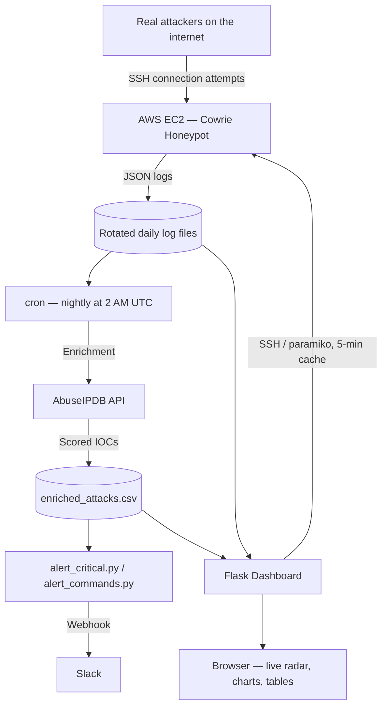

<h1 align="center">🛰️ HoneypotIntel</h1>

<p align="center">
  
  
  
  
  
</p>

<p align="center">
  A live, cloud-hosted SSH honeypot with an automated threat intelligence pipeline —<br/>
  running unattended on AWS, catching real internet attack traffic, and surfacing genuine malware deployment attempts.
</p>

<p align="center">
  <a href="./CASE_STUDY.md">
    
  </a>
</p>

---

### ⚡ Overview

Most student security projects simulate attacks. This one doesn't — **HoneypotIntel** is a decoy SSH server deliberately exposed on the open internet, and it has been catching real, unscripted attack traffic from strangers scanning the internet, continuously, for weeks. Every connection is automatically cross-referenced against a live threat intelligence database, visualized on a real-time dashboard, and — when something serious happens — pushed straight to Slack.

The standout result: a fully captured, multi-stage **malware deployment attempt**, logged command-by-command, safely, from a real attacker who didn't know they were talking to a decoy.

---

### 📊 Live Results

Real numbers, captured by the honeypot and refreshed automatically every night:

| Metric | Value |
|---|---|
| Connections logged | 2,000+ |
| Unique attacker IPs | 1,400+ |
| Scored critical (AbuseIPDB 90–100) | 80%+ |
| Cumulative abuse reports across all IPs | 340,000+ |
| Origin countries | 25+ |
| Interactive command sessions (past automated scanning) | 16+ |
| Honeypot uptime | 4+ weeks and counting |

---

### ✨ Key Features

* 🛰️ **Live radar-view dashboard** — a cinematic, continuously animated visualization of recent attacker activity, color-coded by threat severity
* 🌐 **Real SSH honeypot** — [Cowrie](https://github.com/cowrie/cowrie) deployed on AWS EC2, capturing genuine internet-wide reconnaissance, not simulated data
* 🧠 **Automated threat intelligence enrichment** — every unique attacker IP is scored against the [AbuseIPDB](https://www.abuseipdb.com/) API, on a nightly, quota-aware schedule
* 🚨 **Real-time Slack alerting** — critical IPs and rare "hands on keyboard" attacker sessions trigger automatic notifications
* 🔄 **Fully automated pipeline** — capture → enrich → alert → visualize, with zero manual intervention required day to day
* 📄 **A real captured incident** — a documented, multi-stage malware deployment attempt, complete with the actual attacker commands

---

### 🛡️ System & Security Architecture

Because this project's entire purpose is exposing infrastructure on purpose, security boundaries matter more here than in a typical app — every decision below was deliberate.

* **Containment:** Cowrie simulates a shell — attacker commands are logged and answered with fake output, but nothing is ever actually executed on a real system. A "compromise" of the honeypot is, by design, just a log entry.
* **Network exposure:** AWS Security Groups deliberately allow inbound traffic only on the honeypot's decoy port; all other access is restricted and key-based only (no password authentication).
* **Credential handling:** The AbuseIPDB API key and Slack webhook URL are never hardcoded — both are read from environment variables, injected directly into the scheduler's environment rather than a shell config file that automation can't see.
* **Quota-aware API usage:** Enrichment tracks when each IP was last successfully scored and skips re-querying anything scored within 30 days — respecting AbuseIPDB's rate limits instead of hammering them.
* **Why there's no public dashboard link:** the dashboard currently authenticates to the honeypot using a private SSH key. Exposing that key to a third-party hosting provider would widen the honeypot's own attack surface — so public deployment is deliberately deferred until a version exists that doesn't require sharing that credential externally. (See [Roadmap](#-roadmap).)

---

### 📸 Dashboard

<p align="center">
  
</p>

---

### ⚙️ Architecture



The entire loop — capture, enrichment, alerting, and dashboard refresh — runs unattended.

---

### 🔩 Pipeline Phases

| Phase | Component | What it does |
|---|---|---|
| 1 | Honeypot Deployment | Cowrie SSH honeypot on AWS EC2, capturing real internet reconnaissance |
| 2 | Threat Intelligence | `enrichment.py` — quota-aware AbuseIPDB enrichment for every unique IP |
| 3 | Detection Engineering | `detection_rules.py` — flags port scans, version probes, brute-force patterns |
| 4 | Automated Response | `automation.py` — executes response playbooks, generates incidents |
| 5 | Reporting | `reporting.py` — executive summaries and incident reports |
| 6 | Alerting | `alert_critical.py` / `alert_commands.py` — real-time Slack notifications |
| 7 | Visualization | Custom Flask/Plotly dashboard, auto-synced from the honeypot over SSH |

---

### 📦 Installation

```bash
git clone https://github.com/Eshaan49/HoneypotIntel.git
cd HoneypotIntel
pip install -r requirements.txt
```

Set required credentials as environment variables — never hardcode these:

```bash
export ABUSEIPDB_API_KEY="your_key_here"
export SLACK_WEBHOOK_URL="your_webhook_url_here"
```

Run manually, or rely on the included cron schedule for full automation:

```bash
python3 enrichment.py        # Threat intelligence enrichment
python3 alert_critical.py    # Critical IP alerting
python3 alert_commands.py    # Interactive session alerting
python3 detection_rules.py   # Detection engine
python3 automation.py        # Automated incident response
python3 reporting.py         # Executive report generation
```

---

### 📁 Project Structure

```
HoneypotIntel/
├── README.md
├── CASE_STUDY.md            # Malware deployment finding — full write-up
├── enrichment.py            # Quota-aware threat intelligence enrichment
├── alert_critical.py        # Slack alerts for critical-scored IPs
├── alert_commands.py        # Slack alerts for interactive attacker sessions
├── detection_rules.py       # Detection engine
├── automation.py            # Automated incident response
├── reporting.py             # Executive report generation
├── enriched_attacks.csv     # Real attack data (enriched)
├── incidents.json           # Generated incidents
├── EXECUTIVE_REPORT.md      # Auto-generated report
├── dashboard/                # Flask + Plotly live dashboard
│   ├── app.py
│   ├── templates/
│   └── static/
└── wazuh_integration.py     # Early scaffold for a planned SIEM integration (see Roadmap)
```

---

### 🧰 Technologies

<p>
  
  
  
  
  
  
  
  
</p>

---

### 🗺️ Roadmap

- [ ] **Public dashboard deployment** — via a safer static-snapshot approach that doesn't require sharing the honeypot's SSH key externally
- [ ] **Wazuh SIEM integration** — `wazuh_integration.py` is an early scaffold from before the project pivoted to a custom dashboard for faster iteration; revisiting this to demonstrate correlation-rule-based detection with an industry-standard SIEM
- [ ] **Multi-service honeypot** — extend beyond SSH to HTTP/FTP
- [ ] **Second threat-intel source** (e.g. GreyNoise or AlienVault OTX) to diversify beyond a single API's rate limit

---

### 👤 Author

**Eshaan Pilar**
Final-year Cybersecurity Engineering student · Building toward a SOC Analyst role
[GitHub](https://github.com/Eshaan49) · [LinkedIn](https://linkedin.com/in/eshaanpilar)

---

### 📄 License

MIT License — see [LICENSE](./LICENSE) for details.

---

<p align="center"><i>Last updated: August 2026 · Status: Live, running unattended with daily automated enrichment and real-time alerting</i></p>
